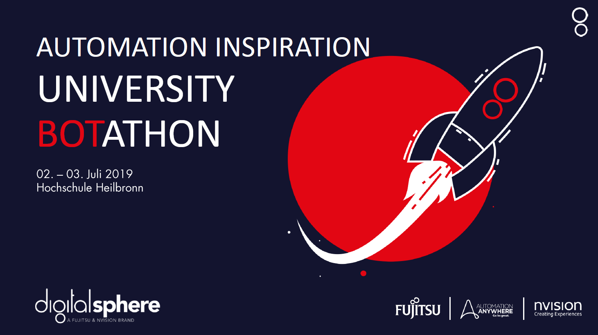
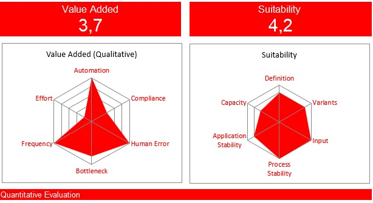
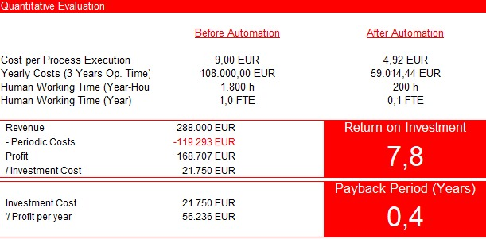

# Welcome to Explore Anywhere

Now you can automate your research for journals on [IEEE Xplore](http://ieeexplore.ieee.org/).

---

# Setup

### Install Automation Anywhere

Download and install the Community Edition from [Automation Anywhere](https://www.automationanywhere.com/de/lp/rpa-editions-comparison).

### Download File

Download the [project files](https://github.com/botathon-hhn-2019/explore.anywhere/blob/master/explore_anywhere.zip?raw=true) and move it to your `My Tasks` folder (e.g. `C:\Users\NAME\Documents\Automation Anywhere Files\Automation Anywhere\My Tasks`).

### Start it
Open Anitmation Anywhere and run the `mainTask`.

---

# About the Project

This project was created on a botathon organised by Hochschule Heilbronn and digitalsphere.
The goal was to automate processes with Automation Anywhere to save resources by saving time.

---

# Challenge Impuls II – State of Art 2.0 (german)

### Herausforderung
Heute stehen Wissenschaftler und Studierende vor der großen Herausforderungen, dass mehr veröffentlicht wird,
als man tatsächlich vernünftig analysieren und verarbeiten kann. Damit mehr Zeit zum Lesen der relevanten Publikationen bleibt, soll ein Roboter in den verschiedenen Datenbanken (z.B.  WISO, Statista, IEEE) oder Online-bibliotheken (z.B. Springer, Elsevier) die relevanten Veröffentlichungen suchen und bereitstellen

### Ziel
* Übergabe des Suchbegriffs an den Roboter
* Zugang über die Webseite der Anbieter und Ausführen der Suche
* Download der Publikationen als PDF in einen lokalen Ergebnisordner

### Erweiterungsoptionen
* Weitere Auswahloptionen für den Auftraggeber der Recherche (z.B. Erscheinungsjahr neuer als x, Sprache, etc.)
* Zusätzliche Erstellung einer Excel oder CSV mit den Daten der heruntergeladenen Publikationen
* Zusätzliche Verifikation, ob der Suchbegriff auch (mehrfach) im Abstract vorkommt

---

# Process
The general process:

---

# Financial Reasons

# Creator
* Jan Leppich
* Michael Orologas
* Tobias Müller
